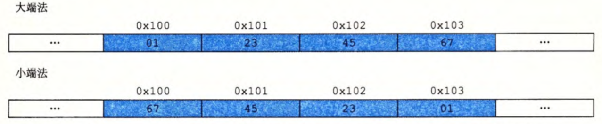

## 进制转换

* 16进制转2进制：每4位二进制转换1位16进制，若二进制位总数不是4的倍数，前面用0补足
* $2^n(n\ge0)$转16进制：将$n$表示成$i+4j（0\le i\le 3）$的形式，则转换后的16进制为0X $2^i$+$j$个0

## 字节顺序

排列一个对象的字节有2个通用的方法：

* 大端法：最高有效字节在前面
* 小端法：最低有效字节在前面

对于16进制数0X1234567，其字节排列顺序如下图所示：



## 位级运算

* 利用异或交换2个值(不使用中间值)

	```c
	void inplace_swap(int *x,int *y)
	{
	    *y = *x ^ *y;
	    *x = *x ^ *y;
	    *y = *x ^ *y
	}
	```

* 左移：丢弃最高的$k$位，并在右端补$k$个0

* 逻辑右移：在左端补$k$个0（用于无符号数）

* 算数右移：在左端补$k$个最高有效位（即符号位）的值（用于无符号数）

* 对于一个由$w$位组成的数据类型，若$k\ge w$，则实际移位量通过计算$k \bmod w$得到（保持位移量小于待移位值的位数）

## 编码

* 无符号数的编码：$B2U_w(x)=\sum_{i=0}^{w-1}x_i2^i$
* 补码：$B2T_w(x)=-x_{w-1}2^{w-1}+\sum_{i=0}^{w-2}x_i2^i$
* 反码：$B2O_w(x)=-x_{w-1}(2^{w-1}-1)+\sum_{i=0}^{w-2}x_i2^i$
* 原码：$B2S_w(x)=(-1)^{x_{w-1}}\cdot(\sum_{i=0}^{w-2}x_i2^i) $
* 原码和反码对数字0有2种不同的编码方式，把$[000\cdots 0]$解释为$+0$，原码中$-0$表示为$[100\cdots 0]$，在反码中$-0$表示为$[111\cdots 1]$
