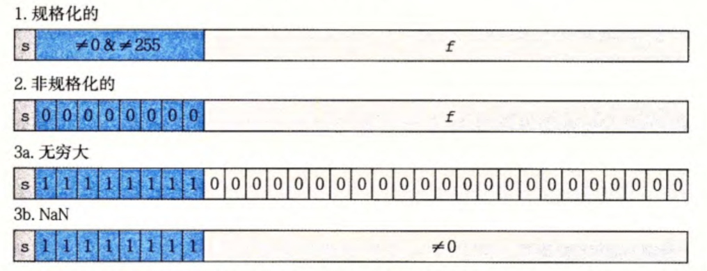

## 进制转换

* 16进制转2进制：每4位二进制转换1位16进制，若二进制位总数不是4的倍数，前面用0补足
* $2^n(n\ge0)$转16进制：将$n$表示成$i+4j（0\le i\le 3）$的形式，则转换后的16进制为0X $2^i$+$j$个0

## 字节顺序

排列一个对象的字节有2个通用的方法：

* 大端法：最高有效字节在前面
* 小端法：最低有效字节在前面

对于16进制数0X1234567，其字节排列顺序如下图所示：


## 位级运算

* 利用异或交换2个值(不使用中间值)

	```c
	void inplace_swap(int *x,int *y)
	{
	    *y = *x ^ *y;
	    *x = *x ^ *y;
	    *y = *x ^ *y
	}
	```

* 左移：丢弃最高的$k$位，并在右端补$k$个0

* 逻辑右移：在左端补$k$个0（用于无符号数）

* 算数右移：在左端补$k$个最高有效位（即符号位）的值（用于无符号数）

* 对于一个由$w$位组成的数据类型，若$k\ge w$，则实际移位量通过计算$k \bmod w$得到（保持位移量小于待移位值的位数）

## 整数表示

### 无符号数的编码

$B2U_w(x)=\sum_{i=0}^{w-1}x_i2^i$

### 有符号数的编码

* 补码：$B2T_w(x)=-x_{w-1}2^{w-1}+\sum_{i=0}^{w-2}x_i2^i$
* 反码：$B2O_w(x)=-x_{w-1}(2^{w-1}-1)+\sum_{i=0}^{w-2}x_i2^i$
* 原码：$B2S_w(x)=(-1)^{x_{w-1}}\cdot(\sum_{i=0}^{w-2}x_i2^i) $
* 原码和反码对数字0有2种不同的编码方式，把$[000\cdots 0]$解释为$+0$，原码中$-0$表示为$[100\cdots 0]$，在反码中$-0$表示为$[111\cdots 1]$

### 类型转换

* 强制类型转换的结果保持位值不变，只是改变了解释这些位的方式
* 当执行一个运算时，如果它的一个运算是有符号的而另一个是无符号的，那么C语言会隐式的将有符号参数强制类型转换为无符号数，并假设这两个数都是非负的，来执行这个运算

### 扩展

* 无符号数的零扩展：要将一个无符号数转换为一个更大的数据类型，只要简单地在表示地开头添加0，这种运算被称为0扩展
* 补码数的符号扩展：要将一个补码数字转换为一个更大的数据类型，可以执行一个符号扩展，在表示中添加最高有效位的值

### 截断

把$x$截断为$k$位的$x'$

* 无符号数的截断：$x'=x\bmod 2^k$
* 无符号数的截断：用补码计算$k$位的$x'$

### 溢出

* 无符号加法中的溢出：对在范围$0\le x,y\le UMax_w$中的$x$和$y$，令$s=x+y$，当且仅当$s<x$（或者等价地$s<y$）时，发生了溢出

* 补码加法中地溢出：对满足$TMin_w\le x,y\le TMax_w$的$x$和$y$，令$s=x+y$，当且仅当$x>0,y>0$，但$s\le 0$时，计算$s$发生了正溢出。当且仅当$x<0,y<0$，但$s\ge 0$时，计算$s$发生了负溢出

	>补码的加法形成了一个阿贝尔群，总会有$(x+y)-y=x$

### 补码的非

$$
\lnot x=
\begin{cases}
TMin,	x=TMin\\
-x,	x>TMin
\end{cases}
$$


1. 对每一位求补，再对结果加1
2. 假设$k$是最右边的1的位置，因而$x$的位级表示形如$[x_{w-1},x_{w-2},\cdots,x_{k+1},0,\cdots,0]$。（只要$x\ne 0$就能找到这样的$k$。）这个值的非携程二进制格式就是$[\lnot x_{w-1},\lnot x_{w-2},\cdots,\lnot x_{k-1},1,0,\cdots,0]$，也就是说，我们对位$k$左边的所有位取反

### 乘除法

在计算常数乘法时，编译器使用了一项重要的优化，试着用移位和加法运算的组合来代替乘以常数因子的乘法

考虑一组从位位置$n$到位位置$m$的连续的$1(n\ge m)$。（14可以写成$[(0\cdots0)(111)(0)]$，则$n=3$，$m=1$)。可以用2种不同的形式来优化$x*K$

* $(x<<n)+(x<<(n-1))+\cdots+(x<<m)$
* $(x<<(n+1))-(x<<m)$

对于使用算数右移（补$k$个最高有效位的值）的补码机器，C表达式

```c
	(x < 0 ? X + (1 << k) - 1 : x) >> x
```

将会计算数值$x/2^k$

## 浮点数

IEEE浮点标准用$V=(-1)^s\times M\times 2^E$的形式来表示一个数

* 符号：$s$决定这数是负数$(s=1)$还是正数$(s=0)$，而对数值$0$的符号位解释作为特殊情况处理
* 尾数：$M$是一个二进制小数，它的范围是$1\sim 2-\epsilon$，或者是$0\sim 1-\epsilon$
* 阶码：$E$的作用是对浮点数加权，这个权重是2的$E$次幂（可能是负数）

给定位表示，根据exp的值，被编码的值可以分成三种不同的情况（最后一种情况有两个变种）



1. 规格化的值：阶码域既不全为0，也不全为1，此时， 阶码的值是$E-Bias$，其中$e$是无符号数，而$Bias$是一个等于$2^{k-1}-1$的偏置值。尾数定义为$M=1+f$

2. 非规格化的值：阶码域为全0，此时，阶码值是$E=1-Bias$，而尾数的值是$M=f$

	>非规格化数有两个用途：提供了一种表示数值0的方法；表示那些非常接近于0.0的数
	>
	>通过将$E$定义为$1-Bias$，而不是$-Bias$，可以补偿非规格化数的尾数没有隐含的开头的1

3. 特殊值：阶码全为1，当小数域全为0时，得到的值表示无穷，当$s=0$时是$+\infty$，$s=1$时是$-\infty$。当小数域为非0时，结果值被称为“NaN"，即”不是一个数（Not a Number)“的缩写。一些运算的结果不能是实数或无穷，就会返回这样的NaN值，比如计算$\sqrt{-1}$或$\infty-\infty$时

### 舍入

最常用的舍入方式为**向偶舍入**：试图找到一个最接近的匹配值，当要舍入的值为两个可能结果的中间数时，它将数字向上或向下舍入，使得结果的最低有效数字是偶数（因此，这种方法将1.5和2.5都舍入成2）

### 浮点运算

* 浮点运算不具有可结合性
* 浮点加法满足了单调性属性：如果$a\ge b$，那么对于任何$a、b$以及$x$的值，除了NaN，都有$x+a\ge x+b$，无符号或补码加法不具有这个实数（和整数）加法的属性

